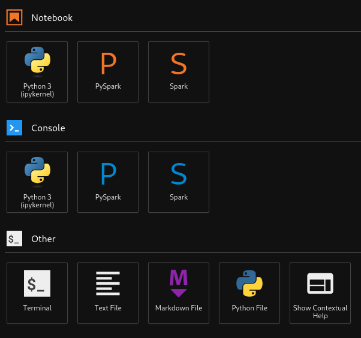

# Intro
Just a sample project for interact using a Jupyter Notebook with PySpark, Iceberg table, all over AWS Glue Catalog.  

Main characteristics:

- Use of the AWS Glue Docker image, which provides a pre-configured environment with Spark and necessary libraries.
https://docs.aws.amazon.com/glue/latest/dg/aws-glue-programming-etl-libraries.html#develop-local-docker-image

- AWS Credentials: Mount your ~/.aws directory, which is convenient but not recommended for production. AM roles are much more secure.

- Workspace mounting at my current directory as my jupyter workspace.

- Port Mappingsthe necessary ports for JupyterLab and potentially Spark UIs.

- Create a Database and Hive-compatible Iceberg table.

- Structured S3 directories in the way warehouse/database/table/[data|metadata] for better organization
<br/>
<br/>

# Follow next steps

## To setup AWS credentials:
Create a AWS profile at ~/.aws/credentials with the needed AWS credentials
```commandline
[user_name]
aws_access_key_id=YOUR_ACCESS_KEY_ID
aws_secret_access_key=YOUR_SECRET_ACCESS_KEY
```

## Download required libraries
Requerired libraries has not been uploaded to repository, dowload them using:
```commandline
cd deploy/jar_libraries/
bash download_libs.sh
```

## Pull AWS Glue Docker image
Docker pull a pre-configured environment with Spark and necessary libraries. Nevertheless, addtional libraries at deploy/jar_libraries will be added later on.
```commandline
docker pull amazon/aws-glue-libs:glue_libs_4.0.0_image_01
```

## Exec Docker container
The docker image contains all needed for setting the Jupyter Notebook environment. Feel free to modify:
- AWS_REGION: AWS Region
- AWS_PROFILE: AWS user credentials 
- DB_NAME: AWS Glue database name
- TB_NAME: AWS Glue table name
- BUCKET_NAME: S3 bucket where datawarehouse will be stored in the following way **warehouse/database/table/[data|metadata]** for better organization

```commandline
docker run -it --rm -v ~/.aws:/home/glue_user/.aws -v `pwd`:/home/glue_user/workspace/jupyter_workspace/  -e AWS_PROFILE=bd_user_tq -e AWS_REGION=eu-west-1 -e DISABLE_SSL=true -e DB_NAME=database_name -e TB_NAME=table_name -e BUCKET_NAME=bd-datawarehouse  -p 4050:4040 -p 18050:18080 -p 8950:8998 -p 8888:8888 --name glue_pyspark_dev amazon/aws-glue-libs:glue_libs_4.0.0_image_01 /home/glue_user/jupyter/jupyter_start.sh
```
Jupyter Notebook will be created

## Enter at Jupyter Notebook
```commandline
Enter at http://127.0.0.1:8888/lab
```
<br/>
---
## Start a new terminal session
At the botton left, click on Terminal



<br/>
Once terminal is available exec the following in order to configure aditional libraries and settings:

```commandline
cd jupyter_workspace/
bash configure_iceberg_glue.sh
```
<br/>

***Here in after, at Jupyter Notebook, open [sample_spark_preprocesing.ipynb](sample_spark_preprocesing.ipynb) jupyter notebook, exece all cells, it's self descriptive.***

<br/>
<br/>


# License

Copyright [2025] [Ander Martínez]

Licensed under the Apache License, Version 2.0 (the "License");
you may not use this file except in compliance with the License.
You may obtain a copy of the License at

http://www.apache.org/licenses/LICENSE-2.0

Unless required by applicable law or agreed to in writing, software
distributed under the License is distributed on an "AS IS" BASIS,
WITHOUT WARRANTIES OR CONDITIONS OF ANY KIND, either express or implied.
See the License for the specific language governing permissions and
limitations under the License.